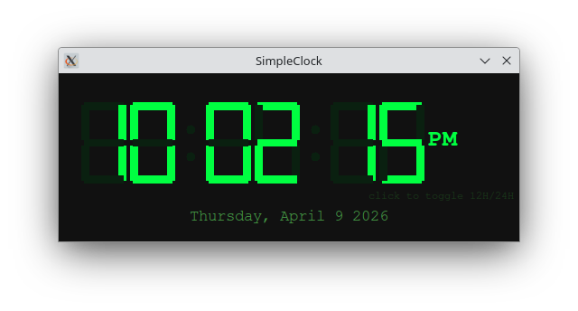

# SimpleClock

# Description and Plan

SimpleClock is exactly what the name implies - a simple clock displayed in a separate window. This is my "Hello World" (or "Hello Claude") project, so I gave Claude/Claude Code as much autonomy as I could to see what it would do. In Claude Code, I started a planning session using the `/plan` command followed by the prompt:

    *Create a standalone app that displays the current time in a stylized digital clockface.*

I didn't specifiy a coding language or style. During the planning, Claude asked if I wanted an HTML or Python app. I expected that Claude would likely choose Python, but was a bit surprized that it offered HTML as well. I wouldn't consider HTML a standalone app, but I didn't try it to see what Claude Code would implement. I indicated I wanted a Python desktop app. Claude also offered a list of display features that might be included. I choose: include seconds, display the current date below the time, offer a 12h/24h toggle (by clicking on the display), and display an AM/PM indicator when in 12h mode. 

From this plan, Claude build a single file desktop app, __clock.py__. At no point did I change the code that Claude Code created. The initial plan is listed below is nearly verbatium from Claude Code's written plan output.

## Implementation

### Single file: `clock.py`

**Structure:**
1. `SEGMENTS` dict — maps digit `0–9` and `-` (colon placeholder) to the 7 active/inactive bitmask
2. `draw_digit(canvas, x, y, digit, color, dim)` — draws one digit's 7 segments on a Canvas at position `(x, y)`. Active segments drawn in bright color, inactive segments drawn in dim color (gives authentic LCD ghost effect)
3. `draw_colon(canvas, x, y, color)` — draws two dots for the `:` separator
4. `ClockApp` class:
   - `__init__`: create `tk.Tk` window (dark background `#111`), create `tk.Canvas`, bind `<Button-1>` to toggle 12/24h mode
   - `toggle_mode()`: flip `self.use_24h` bool
   - `update()`: get `datetime.now()`, compute display values, call `draw_digit` for each digit position (HH MM SS), update date label, schedule next call with `self.root.after(200, self.update)` (200ms for smooth colon blink)
   - Colon blink: alternate on/off each second using `second % 2`

**Layout (Canvas, ~600×200px):**
```
┌──────────────────────────────────────────────────────┐
│                                                      │
│   [H][H] : [M][M] : [S][S]    AM                    │
│                                                      │
│            Wednesday, April 9 2026                  │
└──────────────────────────────────────────────────────┘
```
- AM/PM label: right of seconds, shown only in 12h mode
- Date label: `tk.Label` below canvas, centered, smaller font
- Click anywhere on window to toggle 12h/24h

**Segment geometry per digit (relative coords, scaled):**
```

 _
|_|   a=top, b=top-right, c=bottom-right,
|_|   d=bottom, e=bottom-left, f=top-left, g=middle
```
Each segment is a thick rounded rectangle (Canvas `create_rectangle` with width=0, fill color).

**Colors:**
- Background: `#111111`
- Active segment: `#00FF41` (matrix green)
- Inactive segment: `#0a2010` (very dark green ghost)
- AM/PM text: `#00FF41`
- Date text: `#449944`

---

## Files to create
- `/home/cap/Code/SimpleClock/clock.py` — entire app (~200 lines)

## Dependencies
- Python 3 standard library only (`tkinter`, `datetime`)
- No pip installs needed

---

## Verification
1. `python3 clock.py` — window opens, clock ticks, seconds update each second
2. Click the window — toggles between 12h (with AM/PM) and 24h display
3. Colons blink every second
4. Date string updates correctly at midnight

# Secondary Changes

After the initial python app was created, I decided I would like to run from a shell script and I would like some testing that the appropriate libraries were available to run the app.  

## Add bash Script to Execute the Python App

My next prompt to Claude Code was:

    *Create a bash shell script that checks for the necessary Python libraries, and if they are present, invokes the clock.py app.*

Claude Code created a bash shell, run_clock.sh that performed a number of tests and if they passed, called the Python script. If the test's failed, the script has some useful error messages about how to proceed. I had Claude Code rename the shell to `simpleclock.sh` using the prompt *Change the name of run_clock.sh to simpleclock.sh.* I encountered the following error message about the missing tkinter package on my first run: 

```
$ ./simpleclock.sh 
ERROR: Python module 'tkinter' is not available.
  On Debian/Ubuntu:  sudo apt install python3-tk
  On Fedora/RHEL:    sudo dnf install python3-tkinter
  On Arch:           sudo pacman -S tk
```

After installing the missing package, the clock displayed as expected:



## Change the Script to Run the App in the Background

My only remaining issue was that the app was running in the foreground. I entered the prompt:

    *Change simpleclock.sh so that the clock.py app is run in the background.* 

Claude proposed to update the shell file by replacing the `exec python3 "$SCRIPT_DIR/clock.py"` with `python3 "$SCRIPT_DIR/clock.py" &`. 

# Thoughts

## Claude Code Made Astute Decisions and Asked Pertinent Questions

* I didn't choose what the display should look like other than "digital" and "stylized". Claude Code offered the seven-segment display for the digits and picked a reasonable size for them.
* Claude Code choose the green color scheme. Bright green or red was typical of the first digital clocks.
* I didn't mention having the date displayed or 12 hour/24 hour toggle, but was offered those as choices during planning.

## The First Attempt Was a Good One

* The initial attempt worked (once the required libraries were installed).
* I know just enough Python to be able to read/fix bugs, but the code in `clock.py` looks good. It could use some more comments, but the choice of variable and function names was decent.
* The digits often appear to have an extra pixel or two or appear to have some lines skewed. I'm not sure if that is a bug or an attempt to make them appear more stylized.

## The Updates Were Minor

This isn't a complicated application; it's a simple clock display that a college sophmore or junior should be able to create. The only changes I felt were needed were the file name choice Claude Code made for the Bash script (that I didn't originally specify) and to run the app in the background rather than the foreground. The latter should probably have not been necessary for me to ask for. Aside from that, the code works, it's readable, and the implementation is straightforward. 

